# MSSQL Plan Optimizer
An article is an introduction to Microsoft SQL Server's plan optimizer & common operators, and provide an more in-depth view & analysis of slow queries (with example)

Link: https://tcd93.github.io/MSSQL-execution-plan/

__*Disclaimer: as MSSQL is a closed-source database, I can not prove that this article is 100% correct, all is based on articles online (which I'll include links) and my own experience, so take it with a grain of salt & happy reading!*__

Note: I don't provide sample data here as it's private & pretty huge, but even if you don't run these data yourself, you should have a pretty good grasp of 
SQL Server's optimizer after reading this

Tool: Microsoft SQL Server Management Tool (MSSM)

---
# Table of contents
- [Execution Plan & Optimizer](#-execution-plan--optimizer)
- [Query Processor](#-query-processor)
- [Statistics](#-statistics)
    - [B-tree index](#-a-little-about-btree-index)
- [Common Operators](#-common-operators)
    - [Joins/aggregator](#-joins--aggregator)
        - [Nested loop](#-nested-loop)
        - [Hash join](#-hash-join)
        - [Merge join](#-merge-join)
    - [Making sense of parallelism & Why merge join is slower than hash join?](#-making-sense-of-parallel-scan)

---

## Execution Plan & Optimizer
### What is an Execution Plan?
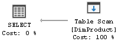

An execution plan is a set of physical operations (operators) that can be performed to produce the required result

The data flow order is from right to left, the thickness of the arrow indicate the amount of data compared to the entire plan; hovering on the icons show extra details


### Retrieving the estimated plan
Retrieving the estimated plan is just telling SQL Server to return the execution plan without actually executing it, helpful in debugging

From MSSM (Microsoft SQL Server Management tool), select an SQL block:
- Press `CTRL + L`
- or: Right click → Display estimated execution plan
- or Query → Display estimated execution plan

### Retrieving the actual plan
In the query menu, tick the “Include Actual Execution Plan” icon

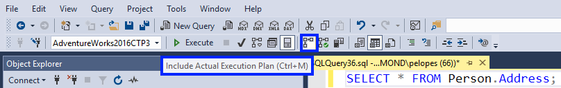

Select & run the query, the plan will be open on a new tab next to result tab

### Estimated vs. Actual
They can differ in cases where the query involves parallelism, variable, hints, current CPU usage… Actual execution plan contains extra runtime information, such as the actual usage metrics (memory grant, actual rows, executions…), and any runtime warnings

<div>
    <figure style="display:inline-block;margin-left:0;width:40%;">
        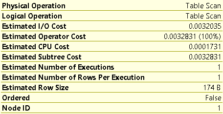
        <figcaption style="font-size:80%;font-style:italic;">Estimated</figcaption>
    </figure>
    vs
    <figure style="display:inline-block;width:40%;">
        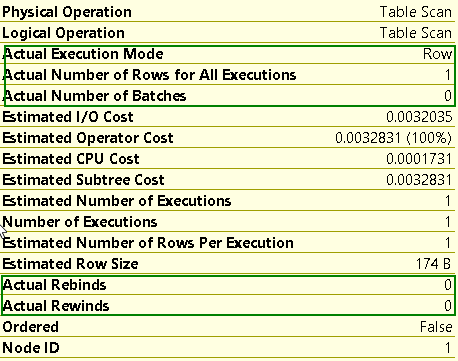
        <figcaption style="font-size:80%;font-style:italic;">Actual</figcaption>
    </figure>
</div>

Actual Plan also include the number of rows processed by each thread, runtime memory allocation...

<div>
    <figure style="display:inline-block;margin-left:0;">
        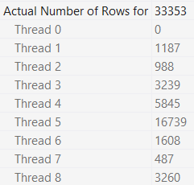
    </figure>
    <figure style="display:inline-block;margin-left:0;">
        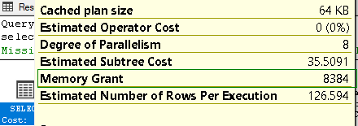
    </figure>
</div>


## Query Processor
What happens when a query is submitted?

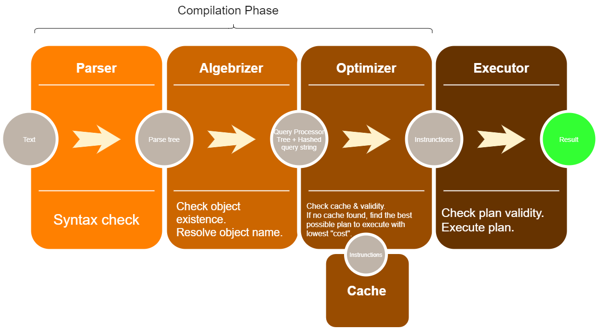

The `algebrizer` resolves all the names of various objects, tables, and columns referred to within the query string. It identifies at the individual column level, all the data types (varchar, datetime…) for the objects being accessed. It also determines the location of aggregates (SUM, MAX…)

The `algebrizer` outputs a binary tree which gives the optimizer knowledge of the logical query structure and the underlying tables and indexes, the output also includes a hash representing the query, the optimizer uses it to see if there is already a plan for this stored in plan cache & whether it’s still valid, if there’s one, then the process stops and __the cached plan is reused__, if not, then it'll compile out an execution plan based on __*statistics*__ & __*cost*__

Once the query is optimized, the generated execution plan may be stored in the plan cache and be executed step-by-step by the physical operators in that plan

### Cost of the plan
The _estimated cost_ is based on a complex mathematical model, and it considers various factors, such as cardinality, row size, expected memory usage and number of sequential and random I/O operations, parallelism overhead… 

__*This number is meaningless outside of the query optimizer's context and should be used for comparison only*__

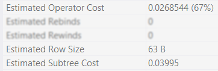
- _Operator Cost_: Cost taken by the operator
- _Subtree Cost_: Cumulative cost associated with the whole subtree up to the node

### Ways to select a plan
The query optimizer finds a number of candidate execution plans for a given query, estimates the cost of each of these plans and selects the plan with the lowest cost. 

For some queries, the optimizer cannot consider every possible plan for every query, it actually has to consider both the cost of finding potential plans and the costs of plans themselves

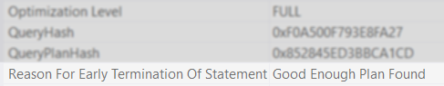
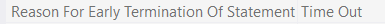

### Plan cache
Whenever a query is run for the first time in SQL Server, it is compiled and a query plan is generated for the query. Every query requires a query plan before it is actually executed. This query plan is stored in SQL Server query plan cache, when that query is run again, SQL Server doesn’t need to create another query plan

The duration that a query plan stays in the plan cache depends upon how often a query is executed. Query plans that are used more often, stay in the query plan cache for longer durations, and vice-versa

_Cache is not used when specific [hints](https://docs.microsoft.com/en-us/sql/t-sql/queries/hints-transact-sql-query?view=sql-server-ver15) are specified (RECOMPILE hint)_

## Statistics
Why is it important?

### The data of data
- The statistics contain information about tables and indexes such as number of rows, the histogram, the density of values from a sample of data; these values are stored in system tables 
- Costs are generated based on statistics, if the stats are incorrect or out-of-date (stale), cost will be wrongly calculated, and the optimizer may choose a sub-optimal plan
- Statistics can be updated automatically, periodically, or manually

### Histogram
_Histogram_ measures the frequency of occurrence for each distinct value in a data set

To create the histogram, SQL server split the data into different buckets (called steps) based on the value of first column of the index. Each record in the output is called as bucket or step

The maximum number of bucket is 200, this can cause problems for larger set of data, where there can be points of _skewed data distributions_, leading to un-optimized plans for special ranges

<blockquote style="font-size:85%">

For example, customer A usually makes 5 purchases per week, but suddenly, at a special day (like Black Friday), he made over 10000 transactions, that huge spike might not get captured in the transaction bucket, and the query for that week would likely get much slower than normal as the `optimizer`'d still think he makes 
very little purchases in that week

</blockquote>

In MSSM, expand _Table > Statistics > Double click a stat name_; some stat names are auto-generated, some are user-defined 

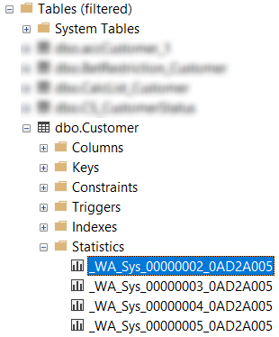

This is a sample histogram of column `MasterID` from _Customer_ table:

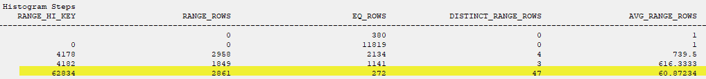

Explanation for the 4th bucket:
* `RANGE_ROWS`: There are 2861 rows with keys from 4183 - 62833
* `EQ_ROWS`: There are 272 rows with key 62834
* `DISTINCT_RANGE_ROWS`: There are 47 distinct rows with keys from 4183 - 62833

Now if we selects 30% of the 4th bucket (`21778` = `(62833 - 4183) * 0.3 + 4183`):
```sql
SELECT * FROM Customer WHERE MasterID BETWEEN 4183 AND 21778
```

This is the generated plan:

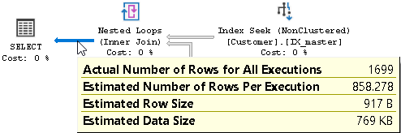

There are 2861 rows from ID 4183 - 62833, so if we’re selecting 30% of that range, it should also results in 30% of 2861 which is 858 rows, that’s the estimated number of the optimizer

### Density
_Density_ is the ratio of unique values with in the given column or a set of columns

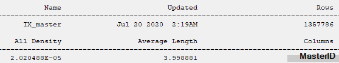

Let's go with this query:
```sql
DECLARE @N INT = 4178
SELECT * FROM Customer WHERE MasterID = @N
```

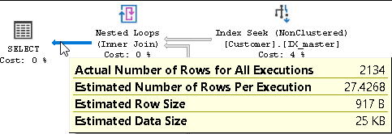

_Histogram cannot be used when we're using parameter_, it then falls back to Density, which is estimated as `Total rows * Density` = `1357786 * 2.020488E-05` = `27.43` rows - but in actuality there is 2134 rows! (as showed in Histogram `EQ_ROWS` attribute). Optimizer failed pretty hard there 🤔

### Memory Grant
- Memory Grant value (kb) can only be seen in Actual execution mode
- This memory is used to store temporary rows for sort, hash join & [parallelism exchange operators](###-parallelism-operators)
- SQL Server calculates this based on statistics, lack of available memory grant causes a `tempdb` spill ([tempDB](https://docs.microsoft.com/en-us/sql/relational-databases/databases/tempdb-database?view=sql-server-ver15) is a global resource that is used to stores all temporary objects)

<blockquote style="font-size:85%">

In SQL server 2012+, a yellow warning icon is displayed in plan explorer when the processor detects a spill (not enough RAM to store data)

For SQL server 2008R2, check the “sort warnings” event in <a href="https://www.sqlshack.com/an-overview-of-the-sql-server-profiler/">SQL profiler</a> to detect memory spill

</blockquote>

#### TempDB Spill
By adding a “order by” clause to the above example, we can produce a _sort warnings_ event in SQL Profiler

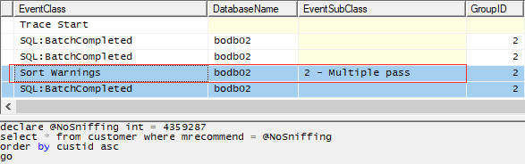

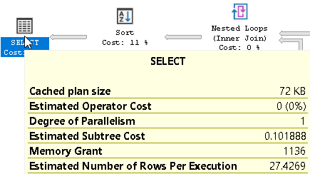

The engine only granted 1136 KB of memory buffer to perform sorting, but in reality the operation needed way more because actual rows are much higher than estimated returned rows, so the input data has to be split into smaller chunks in _tempDB_ to accommodate the granted space to be sorted, then extra passes are performed to merge these sorted chunks

To fix this, we can simply add the __RECOMPILE__ hint to the query, this forces the parse to replace the `@N` parameter with actual value, therefore correctly using the Histogram table

---

## A little about B+Tree Index
Index is a set of ordered values stored in 8kb pages, the pages form a B+tree structure, and the value contains pointer to the pages in the next level of the tree

The pages at the leaf nodes can be data pages (clustered index) or index pages (non-clustered index)

Clustered index (CI) is the table itself, 1 table can only have 1 CI; NonCI’s leaf may refer to the CI’s key, so _any changes to the CI’s key will force changes to every NonCI’s structures_

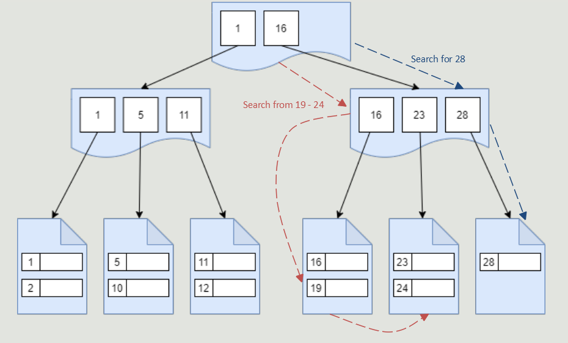

With scan, we need to scan 6 pages to reach key 28, whereas going top-down (seek), we just need to read 2 index pages and 1 data page (3 logical/physical reads = 3 * 8kb = 24kb)

Seek & scan can be combined, where a seek happens first to find where to start scanning, this is still displayed as an _index seek_ operator in plan view

---

## Common Operators
### Sort
<table>
    <tr>
        <th>Icon</th>
        <th>Name</th>
        <th>Description</th>
    </tr>
    <tr>
        <td></td>
        <td>Sort</td>
        <td>Reads all input rows, sorts them, and then returns them in the specified order</td>
    </tr>
</table>

Sort is a _blocking_ operation, it has to read all data into RAM, and sort it. It is both time & memory consuming

If the data is too big for granted memory, a [spill](####-tempdb-spill) happens, making Sort less efficient

### Data Retrievers
<table>
    <tr>
        <th>Icon</th>
        <th>Name</th>
        <th>Description</th>
    </tr>
    <tr>
        <td></td>
        <td>Index seek / Non-clustered index seek</td>
        <td>Finds a specific row in an index, based on key value; and optionally continues to scan from there in logical (index) order</td>
    </tr>
    <tr>
        <td></td>
        <td>Index scan / Non-clustered index scan</td>
        <td>Reads all data from an index, either in <a href="https://sqlperformance.com/2015/01/t-sql-queries/allocation-order-scans">allocation order</a> or in logical (index) order</td>
    </tr>
    <tr>
        <td></td>
        <td>Key lookup</td>
        <td>Reads a single row from a clustered index, based on a key that was retrieved from a non-clustered index on the same table.<br>
        A Key lookup is a very expensive operation because it performs random I/O into the clustered index.<br>
        For every row of the non-clustered index, SQL Server has to go to the Clustered Index to read their data.<br>
        We can take advantage of knowing this to improve the query performance</td>
    </tr>
    <tr>
        <td></td>
        <td>Table scan</td>
        <td>Reads all data from a heap table, in allocation order</td>
    </tr>
</table>

### Joins / Aggregator
<table>
    <tr>
        <th>Icon</th>
        <th>Name</th>
        <th>Description</th>
    </tr>
    <tr>
        <td></td>
        <td>
        
[Hash match/aggregate](####-hash-match)      
        
</td>
        <td>Builds a hash table from its first input, then uses that hash table to either join to its second input, or produce aggregated values</td>
    </tr>
    <tr>
        <td></td>
        <td>

[Merge join](####-merge-join)

</td>
        <td>Joins two inputs that are ordered by the join key(s), exploiting the known sort order for optimal processing efficiency</td>
    </tr>
    <tr>
        <td></td>
        <td>Stream aggregate</td>
        <td>Computes aggregation results by reading a sorted input stream and returning a single row for each set of rows with the same key value</td>
    </tr>
    <tr>
        <td></td>
        <td>

[Nested loop](####-nested-loop)

</td>
        <td>Joins two inputs by repeatedly executing the second input for each row in the first input</td>
    </tr>
</table>

### Parallelism operators
<table>
    <tr>
        <th>Icon</th>
        <th>Name</th>
        <th>Description</th>
    </tr>
    <tr>
        <td></td>
        <td>
        
[Distribute streams](####-distribute-streams)
        
</td>
        <td rowspan="3">The parallelism operators, also known as exchange operators, manage the distribution of rows between threads in parallel plans</td>
    </tr>
    <tr>
        <td></td>
        <td>
        
[Repartition streams](####-making-sense-of-parallel-scan)

</td></tr>
    <tr>
        <td></td>
        <td>
        
[Gather streams](####-gather-streams)

</td></tr>
</table>

### Spools
<table>
    <tr>
        <th>Icon</th>
        <th>Name</th>
        <th>Description</th>
    </tr>
    <tr>
        <td></td>
        <td>Table spool</td>
        <td>Stores its input rows in an internal worktable; this worktable can then be used to re-process the same data</td>
    </tr>
    <tr>
        <td></td>
        <td>Index spool</td>
        <td>Stores its input rows in an internal, indexed worktable; this indexed worktable can then be used to re-process specific subsets of the data</td>
    </tr>
</table>

---

#### Nested loop
[Source](https://bertwagner.com/posts/visualizing-nested-loops-joins-and-understanding-their-implications/)

<div>
    <span style="display:inline-block;width:30%;">
        <ul>
            <li>O(n.m) / <i>O(nlog(m))</i>*</li>
            <li>Require data sorted: No</li>
            <li>CPU cost: Low</li>
            <li>Memory grant: Maybe</li>
            <li>Spill-able?: No</li>
            <li>Blocking: No / <i>Semi</i>**</li>
            <li>
                Optimal for:
                <ul>
                    <li>Small outer input → Small/Medium (indexed) inner input</li>
                    <li>Low cardinality data</li> 
                    <li>OLTP</li>
                </ul>
            </li>
        </ul>
    </span>
    <span style="display:inline-block;">
        <figure>
            
            <figcaption style="font-size:80%;font-style:italic;">this gif demonstrates “brute-force” type of NL</figcaption>
        </figure>
    </span>
</div>

<blockquote style="font-size:85%">

(*) SQL Server can use multiple ways to optimize a nested loop (to get Big O of <i>nlog(m)</i> time complexity)
<ul>
    <li><a href="https://sqlserverfast.com/epr/table-spool/#:~:text=The%20Table%20Spool%20operator%20is,operators%20to%20produce%20them%20again.">Spool</a> in inner loop to maximize reusability</li>
    <li>Perform index seek on inner loop</li>
    <li>Prefetch data in inner loop</li>
</ul>

(**) Order inner loop implicitly to create Semi-blocking nested loop

</blockquote>

##### Nested loop prefetching (`WithUnorderedPrefetch: True`)
Example plan:

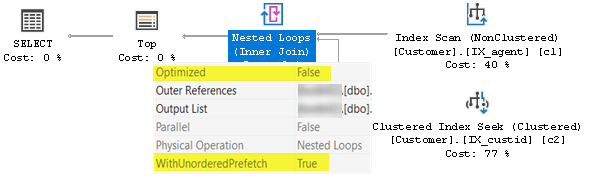

Scans `IX_agent` index, for each agent, seek the corresponding customer __asynchronously__ from `IX_custid`, forward the result whenever it's available

<blockquote style="font-size:85%">

When <code>WithUnorderedPrefetch</code> is set to False, the index-seek-result result will be forwarded only when the previous ordered key is fetched & forwarded

</blockquote>

##### Optimized nested loop (`Optimized: True`)
Example plan:

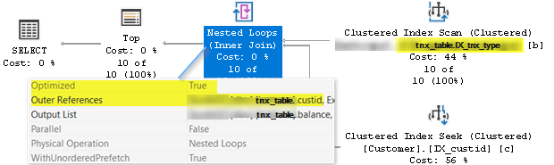

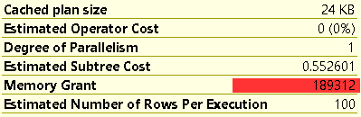

1. Scans `IX_tnx_type` index
2. May implicitly perform an (partial) "_order by_" to create less random seeks; hence the high memory usage
3. If memory does not fit, it’ll fill what it can, so it does not spill

<blockquote style="font-size:85%">

<ul>
    <li>Although getting just 10 rows, the above plan still requires 189,312 KB of sorting space</li>
    <li>Concurrent runs of above query cause high <b>RESOURCE_SEMAPHORE</b> wait, leading to slower performance (fixed in 2016)</li>
    <li>The sort method & memory grant algorithm is different to a normal sort operator, there’s no guarantee that it is faster than same query without optimization</li>
    <li>This is treated as a “safety net” in case the statistics are out-of-date</li>
</ul>

</blockquote>

#### Hash match
[Source](https://bertwagner.com/posts/hash-match-join-internals/)

<div>
    <span style="display:inline-block;width:30%;">
        <ul>
            <li>O(n + m)</li>
            <li>Require data sorted: No</li>
            <li>CPU cost: High</li>
            <li>Memory grant: <b>Yes</b></li>
            <li>Spill-able?: Yes</li>
            <li>Blocking: Yes</li>
            <li>
                Optimal for:
                <ul>
                    <li>Medium build input → Medium/Large probe input</li>
                    <li>Medium/high cardinality data</li>
                </ul>
            </li>
            <li><b>Scales well with parallelism</b></li>
        </ul>
    </span>
    <span style="display:inline-block;">
        <figure>
            
        </figure>
    </span>
</div>

#### Merge join
[Source](https://bertwagner.com/posts/visualizing-merge-join-internals-and-understanding-their-implications/)

<div>
    <span style="display:inline-block;width:30%;">
        <ul>
            <li>O(n + m)</li>
            <li>Require data sorted: <b>Yes</b></li>
            <li>CPU cost: Low</li>
            <li>Memory grant: No</li>
            <li>Spill-able?: No</li>
            <li>Blocking: No</li>
            <li>
                Optimal for:
                <ul>
                    <li>Evenly sized inputs</li>
                    <li><a href="https://sqlserverfast.com/blog/hugo/2017/12/many-many-reads-many-many-merge-join/">One to many</a></li>
                </ul>
            </li>
            <li><b>Scales badly parallelism</b></li>
        </ul>
    </span>
    <span style="display:inline-block;">
        <figure>
            
        </figure>
    </span>
</div>

#### Making sense of parallel scan

This is the explain plan produced from the following query:
```sql
SELECT [product].id, [tnx_table].amount...
FROM tnx_table
INNER JOIN product
ON [tnx_table].prod_id = [product].id
```

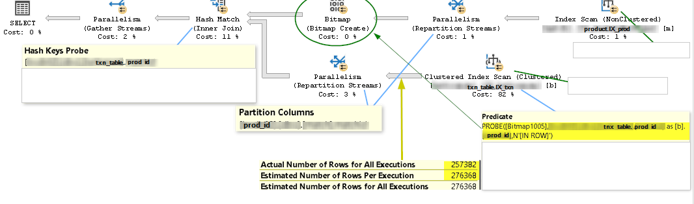

First, the engine scans the `IX_prod` index, in parallel, the distribution of rows among threads can be considered as “random”; each time the query runs, each thread will handle different number of rows

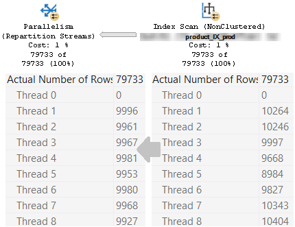

After scanning, SQL Server repartitions the rows in each thread, arranging them in a __deterministic__ order, rows are now distributed “correctly” among threads; _each time the query runs, each thread will handle same number of rows_

This operator requires some buffer space to do the sorting

Next, it'll allocate some space to create a [bloom filter](https://en.wikipedia.org/wiki/Bloom_filter) (bitmap)

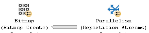

When the second index scan starts, it also include a probe action that checks on the bitmap net. If the bit is “0”, that means the key does not exists in the first index, if the bit is “1”, that means the key _may_ exists in the first index and can pass through into repartition streams

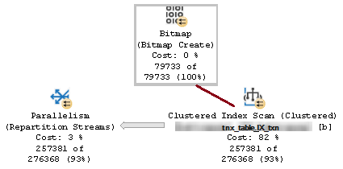

With bitmap, the actual number of rows after the scan is reduced

With the two sources ready & optimized, the Hash join operation can be done quickly in parallel and finally merged together

Here's a summary chart (_note that `mod % 2` & `mod % 10` are not actual MS hash function implementation_):

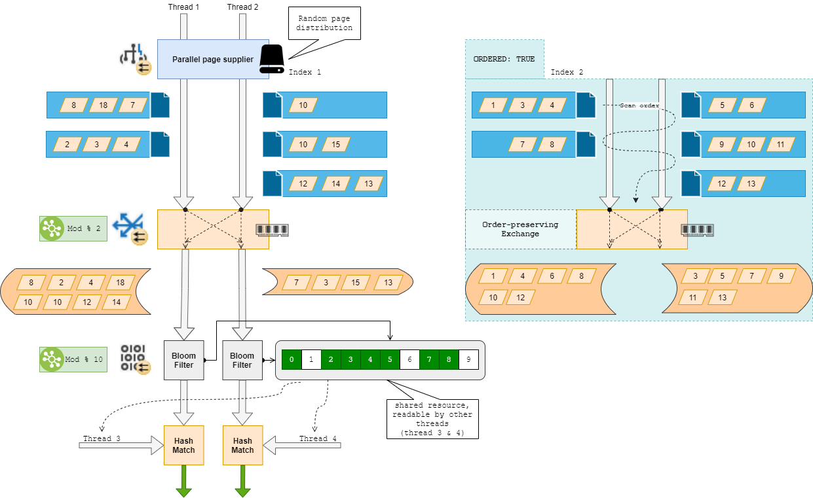

In this example, values in thread 1 & 2 pass through the `bloom filter` (with hash function `mod % 10`) and only 7 bits is turned on, when thread 3 & 4 come and look up on the bitmask, any value which divided by 10 returns a remainder of 1, 6 or 9 would get filtered, these are the _false negative_ matches. The rest, continue on and be filtered again by the _hash match_ function, with much less need for memory

<blockquote style="font-size:85%">

<b>Types of scan:</b>

<b>Unordered scan</b> (Allocation Order Scan) using using internal page allocation information
<ul>
    <li>Favorable for <i>Hash match</i></li>
</ul>

<b>Ordered scan</b>, the engine will scan the index structure
<ul>
    <li>Favorable for <i>Merge join</i></li>
    <li><i>During order-preserving re-partition exchange, it does not do any sorting</i>, it just keep the order of output stream the same as the input stream</li>
</ul>

</blockquote>

#### Comparing Merge & Hash, in parallel plans
This is a side-by-side comparation of a merge join & hash join, both produce same set of records

The query is simple:
```sql
--hash
select f.custid, d.Week, sum(f.Amount) 
from Fact f
inner join DimDate d
on f.RptDate = d.PK_Date
-- where d.PK_Date >= '2020-01-01' (uncomment to get merge join plan)
group by f.custid, d.Week
```

Merge join plan is evaluated by adding a where clause filter by date, the optimizer will now go for _index seek_ in the `DimDate` table, but `2020-01-01` is way lower than the actual data range in `Fact` table, so both queries produce same result

<div>
    <figure style="display:block;margin-left:0;">
        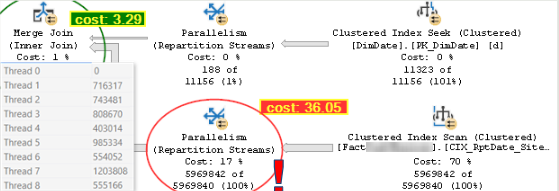
        <figcaption style="font-size:80%;font-style:italic;">Merge</figcaption>
    </figure>
    vs
    <figure style="display:block;margin-left:0;">
        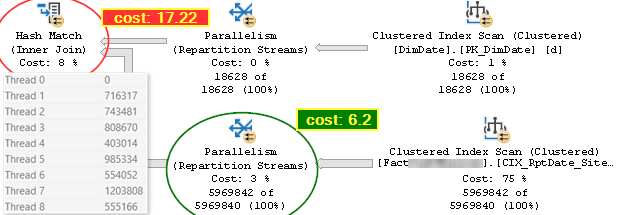
        <figcaption style="font-size:80%;font-style:italic;">Hash</figcaption>
    </figure>
</div>

Since the _index seek_ generate an ordered result set, optimizer tries to make use of an _merge join_ plan, but data from `Fact` table's _clustered index scan_ are not yet ordered, the engine must do it implicitly in the _ordered repartition streams_ operator, thus giving very high cost compared to the _hash join_ one

<blockquote style="font-size:85%">
    We can keep track of these symptoms by monitoring the CXPACKET & SLEEP_TASK wait types (for SQL Server 2008)
</blockquote>

**Where the fun begins**

In normal circumstances, both queries' performance is very similar (around 5s for 200k records)

Now, put the system CPU under load (by running many queries at same time using __SQL Stress Test__), the _merge join_ becomes slower the more threads used, whereas _hash join_'s performance is very consistent (when CPU at 90% load, _merge_ took 13s)

<div>
    <figure style="display:inline-block;margin-left:0;width:40%;">
        
        <figcaption style="font-size:80%;font-style:italic;">Merge</figcaption>
    </figure>
    vs
    <figure style="display:inline-block;margin-left:0;width:40%;">
        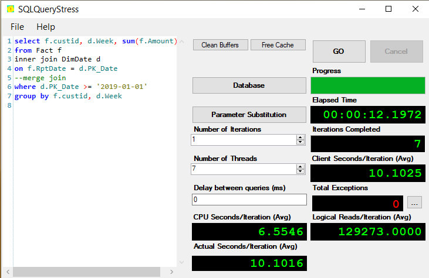
        <figcaption style="font-size:80%;font-style:italic;">Hash</figcaption>
    </figure>
</div>

__Why?__ 

In _merge_, the order-preserving exchange operator has to run sequentially to get pages from the scan, so at this point it is actually running in _single thread_ mode, and when the CPU is under pressure, it’ll have to wait up to 4ms (a _quantum_, see [SQLOS](https://blog.sqlauthority.com/2015/11/11/sql-server-what-is-sql-server-operating-system/)) to get the next batch of pages

In _hash_, at no point the execution is done synchronously, parallel execution is used at 100% power, so it is very effective

__SQLOS__

We've only touched the surface of _SQLOS_ - a operating system sitting between SQL Server & real OS to manage services such as thread, memory. There's a lot of interesting thing going on behind the scene, I'll write up another article for this at another time

#### Gather streams
Consider the SQL:
```sql
--get all "above-average" transactions by products
select prod_id, tran_date, amount, avg_amount
	from (
		select prod_id, custid, tran_date, amount, 
			avg(amount) over (partition by prod_id) avg_amount
		from tnx_table
		where tran_date between ... and ...
	) i
where stake >= avg_stake
order by prod_id
```

<span style="font-size:120%;font-weight:bold">

Execution time is 8 seconds, but with threading disabled (by adding `option (maxdop 1)`), execution time drops to 1 second

</span>

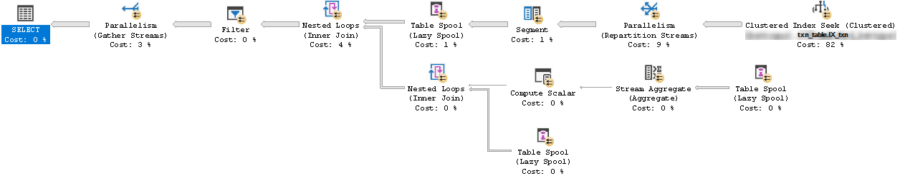

<span style="font-size:70%">This is the last part of the plan</span><br>


In this example, lots of _exchange spill events_ are caught

An [exchange spill](https://www.erikdarlingdata.com/sql-server/spills-week-exchange-spill-excruciation/#:~:text=The%20Exchange%20Spill%20event%20class,plan%20has%20multiple%20range%20scans%E2%80%A6) is like a [`tempdb` spill](####-tempdb-spill), it is a buffer overflow event that happens inside of a thread

Here's a [visualized version](https://forrestmcdaniel.com/2019/09/30/grokking-the-paul-white-parallel-deadlock-demo/) of the above plan:


Because of the uneven distribution of data in threads (_skewed data_), the ones that have more rows (1 & 4) are more likely to wait for thread 2 & 3 to keep returned rows in order, while piling up their internal buffer, eventually leading to a spill

To fix this, we need to eliminate the _skewness_ by splitting up data into two parts:
```sql
with [avg] as (
	select prod_id, avg(amount) amount, min(tran_date) min_tdate, max(tran_date) max_tdate
	from tnx_table
	where tran_date between ... and ...
	group by prod_id
)
select a.prod_id, a.tran_date, a.amount, [avg].amount avg_amount
from tnx_table a
inner join [avg]
on a.amount >= [avg].amount
	and a.prod_id = [avg].prod_id
	and a.tran_date between [avg].min_tdate and [avg].max_tdate
order by prod_id
```

Now it executes instantly:

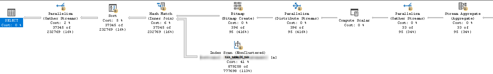

Keep in mind that _exchange spill_ can happen with any __blocking__ operator:

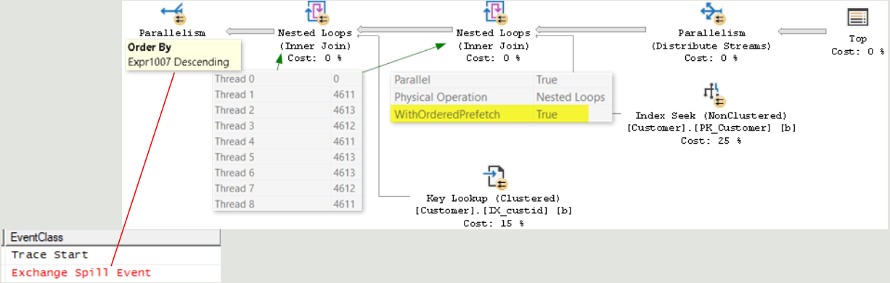

#### Distribute streams
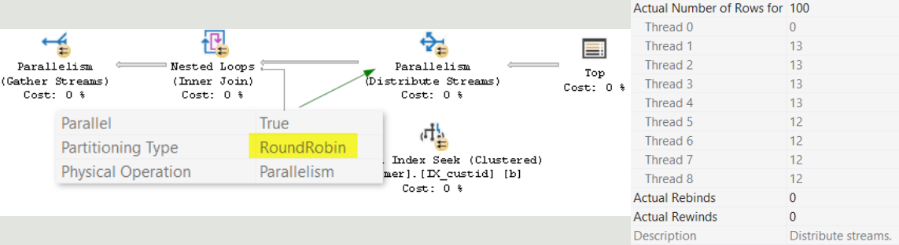

Distribute rows from a single-threaded operation across multiple threads

Common types:
- Hash (for Hash join)
- Round-Robin (for Nested Loop join)
- Broadcast (for small set of input)

#### Spools
A spool is created when the optimizer thinks that data reuse is important (prevent multiple seeks or scans on same index/heap)

_There are two types of spool: lazy & eager_

- Eager Spool catches all the rows received from another operator (ex: Index scan, concatenation...) and store these rows in TempDB (blocking)

- Lazy Spool is similar to eager spool, but it only reads and stores the rows in a temporary table only when the parent operator actually asks for a row (non-blocking)

**Lazy Spool**

We're using the previous plan example of _gather streams_, without parallelism

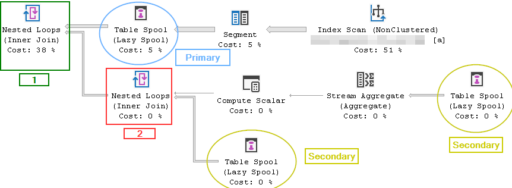

We’ll see that there are 3 lazy spool operators, but it is actually just one instance (by hovering on it, they have the same primary node id)

The data flow goes as below:

1. The operator scan the transaction table to continuously retrieve all data
2. Once a segment got all records of a same customer, it copies all rows into a table spool, those rows are then used as the outer input of a nested loop _(1)_
3. For each loop _(1)_, it scan the entire spool, calculate the average transaction amount of that customer (aggregate), the result is a single row that get passed as outer input into another nested loop _(2)_
4. The processor scan the spool again, row-by-row to compare with the number from step 3, returning rows that are less than that number
5. When the index scan is done for another batch of customer rows, the spool is truncated and refill with new data, repeat until all customers are done

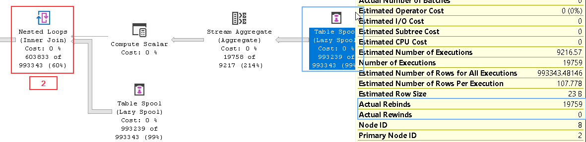

<blockquote style="font-size:85%">

The number of customers in the transaction table is 19758

The spool is rebound 19759 times meaning it got truncated & repopulated 19758 times for each customer + 1 time on the first creation

</blockquote>

**Eager Spool**

QUERY: Add 100 to all `MasterID`s in the customer table

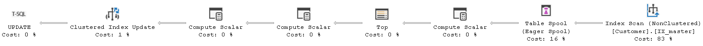

Due to MasterID being key in a non-clustered index (IX_master), updating it will physically change it’s location (move towards the right end of the b-tree), if the scan operation is from left to right, then the updated row might be reread & updated again

The eager spool is created to temporary store old rows, making sure that each row is read only once

