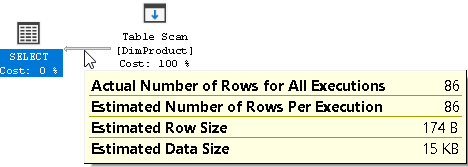

# MSSQL Plan Optimizer
An article is an introduction to Microsoft SQL Server's plan optimizer & common operators, and provide an more in-depth view & analysis of slow queries (with example)

_note: I don't provide sample data here as it's private & pretty huge, but even if you don't run these data yourself, you should have a pretty good grasp of 
SQL Server's optimizer after reading this_

Tool: Microsoft Sql Server Management Tool (MSSM)

---

## Execution Plan & Optimizer
### What is an Execution Plan?


An execution plan is a set of physical operations (operators) that can be performed to produce the required result

The data flow order is from right to left, the thickness of the arrow indicate the amount of data compared to the entire plan; hovering on the icons show extra details



### Retrieving the estimated plan
Retrieving the estimated plan is just telling SQL Server to return the execution plan without actually executing it, helpful in debugging

From MSSM (Microsoft SQL Server Management tool), select an SQL block:
- Press `CTRL + L`
- or: Right click → Display estimated execution plan
- or Query → Display estimated execution plan

### Retrieving the actual plan
In the query menu, tick the “Include Actual Execution Plan” icon


Select & run the query, the plan will be open on a new tab next to result tab

### Estimated vs. Actual
They can differ in cases where the query involves parallelism, variable, hints, current CPU usage… Actual execution plan contains extra runtime information, such as the actual usage metrics (memory grant, actual rows, executions…), and any runtime warnings

<div>
    <figure style="display:inline-block;margin-left:0;">
        </img>
        <figcaption style="font-size:80%;font-style:italic;">Estimated</figcaption>
    </figure>
    vs
    <figure style="display:inline-block;">
        </img>
        <figcaption style="font-size:80%;font-style:italic;">Actual</figcaption>
    </figure>
</div>

Actual Plan also include the number of rows processed by each thread, runtime memory allocation...

<div>
    <figure style="display:inline-block;margin-left:0;">
        </img>
    </figure>
    <figure style="display:inline-block;">
        </img>
    </figure>
</div>


## Query Processor
What happens when a query is submitted?


The algebrizer resolves all the names of various objects, tables, and columns referred to within the query string. It identifies at the individual column level, all the data types (varchar, datetime…) for the objects being accessed. It also determines the location of aggregates (SUM, MAX…)

The algebrizer outputs a binary tree which gives the optimizer knowledge of the logical query structure and the underlying tables and indexes, the output also includes a hash representing the query, the optimizer uses it to see if there is already a plan for this stored in plan cache & whether it’s still valid, if there’s one, then the process stops and __the cached plan is reused__, if not, then it'll compile out an execution plan based on __*statistics*__ & __*cost*__

Once the query is optimized, the generated execution plan may be stored in the plan cache and be executed step-by-step by the physical operators in that plan

### Cost of the plan
The _estimated cost_ is based on a complex mathematical model, and it considers various factors, such as cardinality, row size, expected memory usage and number of sequential and random I/O operations, parallelism overhead… 

__*This number is meaningless outside of the query optimizer's context and should be used for comparison only*__


- _Operator Cost_: Cost taken by the operator
- _Subtree Cost_: Cumulative cost associated with the whole subtree up to the node

### Ways to select a plan
The query optimizer finds a number of candidate execution plans for a given query, estimates the cost of each of these plans and selects the plan with the lowest cost. 

For some queries, the optimizer cannot consider every possible plan for every query, it actually has to consider both the cost of finding potential plans and the costs of plans themselves


### Plan cache
Whenever a query is run for the first time in SQL Server, it is compiled and a query plan is generated for the query. Every query requires a query plan before it is actually executed. This query plan is stored in SQL Server query plan cache, when that query is run again, SQL Server doesn’t need to create another query plan

The duration that a query plan stays in the plan cache depends upon how often a query is executed. Query plans that are used more often, stay in the query plan cache for longer durations, and vice-versa

_Cache is not used when specific [hints](https://docs.microsoft.com/en-us/sql/t-sql/queries/hints-transact-sql-query?view=sql-server-ver15) are specified (RECOMPILE hint)_

## Statistics
Why is it important?

### The data of data
- The statistics contain information about tables and indexes such as number of rows, the histogram, the density of values from a sample of data; these values are stored in system tables 
- Costs are generated based on statistics, if the stats are incorrect or out-of-date (stale), cost will be wrongly calculated, and the optimizer may choose a sub-optimal plan
- Statistics can be updated automatically, periodically, or manually

### Histogram
_Histogram_ measures the frequency of occurrence for each distinct value in a data set

To create the histogram, SQL server split the data into different buckets (called steps) based on the value of first column of the index. Each record in the output is called as bucket or step

The maximum number of bucket is 200, this can cause problems for larger set of data, where there can be points of _skewed data distributions_, leading to un-optimized plans for special ranges. For example, customer A usually makes 5 purchases per week, but suddenly, at a special day (like Black Friday), he made over 10000 transactions, that huge spike might not get captured in the transaction bucket, and the query for that week would likely get much slower than normal as the optimizer'd still think he makes 
very little purchases in that week

In MSSM, expand _Table > Statistics > Double click a stat name_; some stat names are auto-generated, some are user-defined 


This is a sample histogram of column `MasterID` from _Customer_ table:


Explanation for the 4th bucket:
* `RANGE_ROWS`: There are 2861 rows with keys from 4183 - 62833
* `EQ_ROWS`: There are 272 rows with key 62834
* `DISTINCT_RANGE_ROWS`: There are 47 distinct rows with keys from 4183 - 62833

Now if we selects 30% of the 4th bucket (`21778` = `(62833 - 4183) * 0.3 + 4183`):
```sql
SELECT * FROM Customer WHERE MasterID BETWEEN 4183 AND 21778
```

This is the generated plan:


There are 2861 rows from ID 4183 - 62833, so if we’re selecting 30% of that range, it should also results in 30% of 2861 which is 858 rows, that’s the estimated number of the optimizer

### Density
_Density_ is the ratio of unique values with in the given column or a set of columns


Let's go with this query:
```sql
DECLARE @N INT = 4178
SELECT * FROM Customer WHERE MasterID = @N
```


_Histogram cannot be used when we're using paramater_, it then falls back to Density, which is estimated as `Total rows * Density` = `1357786 * 2.020488E-05` = `27.43` rows - but in actualality there is 2134 rows! (as showed in Histogram `EQ_ROWS` attribute). Optimizer failed pretty hard there 🤔

### Memory Grant
- Memory Grant value (kb) can only be seen in Actual execution mode
- This memory is used to store temporary rows for sort, hash join & parallelism exchange operators
- SQL Server calculates this based on statistics, lack of available memory grant causes a tempdb spill ([tempDB](https://docs.microsoft.com/en-us/sql/relational-databases/databases/tempdb-database?view=sql-server-ver15) is a global resource that is used to stores all temporary objects)

In SQL server 2012+, a yellow warning icon is displayed in plan explorer when the processor detects a spill (not enough RAM to store data)

For SQL server 2008R2, check the “sort warnings” event in [SQL profiler](https://www.sqlshack.com/an-overview-of-the-sql-server-profiler/) to detect memory spill

#### TempDB Spill
By adding a “order by” clause to the above example, we can produce a _sort warnings_ event in SQL Profiler


The engine only granted 1136 Kb of memory buffer to perform sorting, but in reality the operation needed way more because actual rows are much higher than estimated returned rows, so the input data has to be split into smaller chunks in _tempDB_ to accommodate the granted space to be sorted, then extra passes are performed to merge these sorted chunks

To fix this, we can simply add the __RECOMPILE__ hint to the query, this forces the parse to replace the `@N` parameter with actual value, therefore correctly using the Histogram table

---